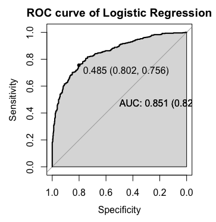
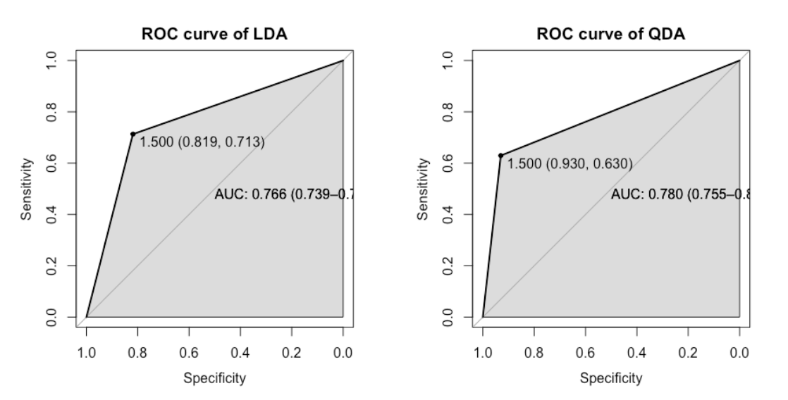
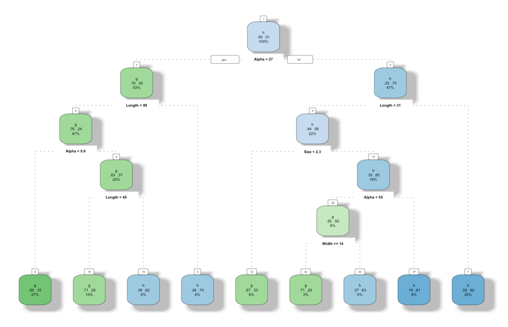
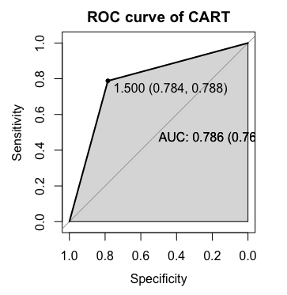
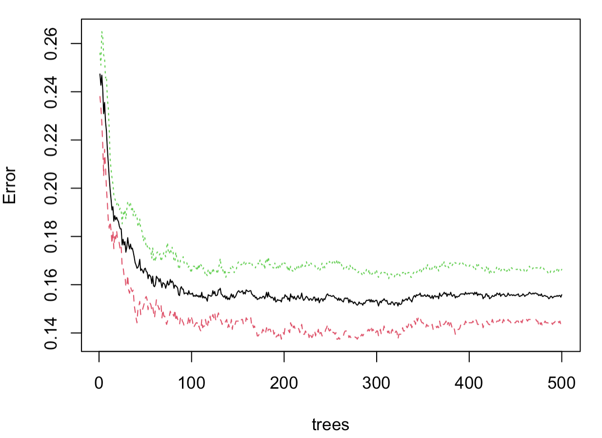
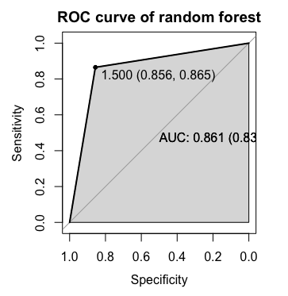
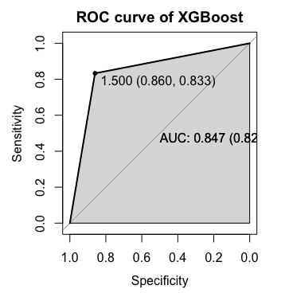

# Analysis of Different Machine Learning Models in Classification  
With the development of imaging technology, high-energy gamma particles can be recorded in the ground-based atmospheric Cherenkov gamma telescope. The particle streams can be distinguished from gamma and hadron streams due to different shower images (Bock et al., 2004). In this project, I will use different models for the classification problem to effectively distinguish between gamma particle (g) and hadron (h). then I will compare the prediction accuracy of different methods, choose a model that performs best, and predict the accuracy on the test set based on optimizing the model of that method. All corresponding R codes can be found in the [mlm.R](https://github.com/atomxu10/MLModel/blob/main/mlm.R).

## Content
- [Data](#1)
- [Classification techniques](#2)
    - [Logistic regression](#2-1)
    - [Discriminant analysis](#2-2)
    - [Decision trees and variants](#2-3)
        - [CART](#2-3-1)
        - [Random forest](#2-3-2)
        - [XGBoost](#2-3-3)
    - [SVM](#2-4)
    - [Neural networks](#2-5)
- [Discussion](#3)

## Data
The data set([gamma.csv](https://github.com/atomxu10/MLModel/blob/main/gamma.csv)) is generated by simulation of the data collected by the atmospheric Cherenkov telescope (UCI Machine Learning Repository: MAGIC Gamma Telescope Data Set, 2022), which is a multivariate data set divided into 10 continuous variables (Length, Width, Size, Conc, Conc1, Asym, M3long, M3Trans, Alpha, Dist), and one categorical variable (g means the gamma particle and h means the hadron). The details of the variables can be found at https://archive.ics.uci.edu/ml/datasets/magic+gamma+telescope. In this project, several variables are available for our discussion of the classification problem. 

75% of the data are randomly selected as the training set and the remaining 25% as the testing set after setting up the seed. The performance of different models is to be checked, so the same testing set and training set are used. After getting different models, the roc curve (receiver operating characteristic curve) is introduced to check the classification performance, the confusion matrix will be introduced to calculate the accuracy of the testing set, and the best model applicable to this data set will be obtained by comparing the accuracy of different classifiers.

## Classification techniques

### Logistic regression

Logistic regression is a generalized linear model that belongs to the domain of supervised learning in machine learning. The derivation process and computational methods of logistic regression are similar to those of linear regression. However, logistic regression is specifically designed to address dichotomous classification problems.

To ensure consistency in the logistic regression model, I standardized the predictors individually to mitigate the impact of differing variable weights caused by significant variations in their values. Using 75% of the training samples, the resulting Logistic regression can be expressed as: 

𝑌 = 0.372 + 1.556 Length + 0.321 Width + 0.180 Size − 0.307 Conc + 0.941 Conc1 + 0.014 Asym − 0.506 M3Long − 0.08 M3Trans + 1.319 Alpha + 0.078 Dist

In Figure 1, the point marked on the ROC curve is labeled with a threshold value of 0.485. The coordinates of this point are (0.802, 0.756), where 0.802 represents sensitivity and 0.756 represents specificity. The AUC value of 0.851 indicates that the model performs well in distinguishing between the two classes. A higher AUC value generally suggests better model performance. The optimal threshold for the logistic regression model is around 0.485. This threshold provides a balanced trade-off between sensitivity (80.2%) and specificity (75.6%). By using this threshold, the model achieves a prediction accuracy of 78.01% on the testing set.

    

Figure 1: ROC (Logistic Regression)

### Discriminant analysis
Discriminant Analysis is a statistical classification technique used to build a predictive model based on known category data, which is then used to classify new data. It is widely applied in pattern recognition, classification problems, and multivariate data analysis. The goal of discriminant analysis is to find a discriminant function or decision boundary that maximizes the separation between different classes.

Discriminant Analysis typically includes two common types: Linear Discriminant Analysis (LDA) and Quadratic Discriminant Analysis (QDA).

1. Linear Discriminant Analysis (LDA):
- Assumption: Assumes that different classes have a normal distribution and share the same covariance matrix.
- Characteristics: LDA seeks to find a linear combination of features that best separates the classes. It is most effective when the decision boundaries between classes are linear.
- Decision Boundary: Linear.

2. Quadratic Discriminant Analysis (QDA):
- Assumption: Assumes that different classes have a normal distribution but can have different covariance matrices.
- Characteristics: QDA allows each class to have its own covariance matrix, providing more flexibility to model non-linear decision boundaries. It is useful when the decision boundaries between classes are quadratic or non-linear.
- Decision Boundary: Quadratic (non-linear).

The project will attempt two different types and compare the model's accuracy on the test set to evaluate the differences between these types.

    

Figure 2: ROC (LDA & QDA)

The Area Under the Curve (AUC) values for the LDA and QDA are 0.766 and 0.780, respectively. Furthermore, when evaluated on the testing set, the accuracy of the LDA classifier is 76.91%, whereas the QDA classifier achieves an accuracy of 78.91%.

### Decision trees and variants
Decision trees are a type of supervised learning algorithm used for classification and regression tasks. They work by recursively splitting the data into subsets based on the feature that provides the maximum information gain or the minimum impurity. Each internal node represents a decision based on a feature, each branch represents the outcome of the decision, and each leaf node represents a class label or continuous value.

#### CART
The CART procedure is a method to produce binary trees given the training data, so at each node, there are two branches, one to the left and one to the right, until we reach the bottom of the tree, The final node will give us the prediction. in this model, the measures available used the Gini index.

    

Figure 3: CART(cp=0.01)

When cp (completeness parameter) = 0.01, we can get the tree with the small xerror (Figure 3), the AUC value of this classifier is 0.786 (Figure 4), and the accuracy of the testing set is at 78.61%

    

Figure 4: ROC (CART) 

#### Random forest
Random forests consist of multiple decision trees, each of which is not identical. it works in the same way as bagging, which has improved accuracy and is less overfitting.

The error within the model becomes largely stable when trees are more than 100 (Figure 5). After debugging the parameters, this random forest model has the lowest prediction error rate when the parameter mtry=2, with an AUC of 0.861 (Figure 6) and a test set accuracy of 85.64%.

    

Figure 5: Random forest 

    

Figure 6: ROC (Random forest) 

#### XGBoost
XGBoost internally implements the GBDT model and optimizes many algorithms in the model to achieve high accuracy and fast speed. In order to prevent overfitting, it only needs about 15 rounds to minimize the test mean square error after testing.

an AUC value of 0.847(Figure 7) and an accuracy of 84.73% for the testing set.

    

Figure 7: ROC (XGBoost) 

### SVM
### Neural networks
## 
